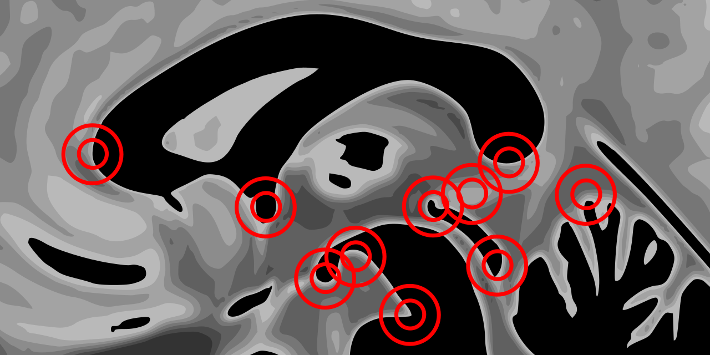

# AFIDs

An open framework for evaluating correspondence in brain images and teaching neuroanatomy using anatomical fiducial placement

**Documentation:** https://afids.github.io/afids-protocol/

**Join our channel:**  

## Introduction

* The AFIDs protocol is an anatomical fiducial placement protocol that has been validated and used for teaching at a number of local and global BrainHack related events.
    * <a href="https://afids.github.io/afids-protocol/afids_protocol/human_protocol.html" target="_blank">Human AFIDs protocol</a>
    * <a href="https://afids.github.io/afids-protocol/afids_protocol/macaca_protocol.html" target="_blank">Macaca AFIDs protocol</a>
* The protocol and study framework leverage open resources/tools and has been developed with full transparency in mind so that others may freely use, adopt, and modify.
* AFID placement is reproducible, not overtly manually intensive (20-40 minutes once trained), and more sensitive to local registration errors than standard voxel overlap measures.
* 60+ raters trained to date.

## References and Resources

### Peer-Reviewed Manuscript

* Lau JC, Parrent AG, Demarco J, Gupta G, Park PJ, Ferko K, Khan AR, Peters TM. A framework for evaluating correspondence between brain images using anatomical fiducials. Human Brain Mapping. 2019. [<a href="http://dx.doi.org/10.1002/hbm.24693" target="_blank">ref1</a>]

### Associated Preprint

* Lau JC, Parrent AG, Demarco J, Gupta G, Park PJ, Ferko K, Khan AR, Peters TM. A framework for evaluating correspondence between brain images using anatomical fiducials. bioRxiv. 2018. [<a href="https://www.biorxiv.org/content/early/2018/11/03/460675" target="_blank">ref1</a>]

### Conference Abstracts

* Lau JC, Parrent AG, Demarco J, Gupta G, Park PJ, Ferko K, Khan AR, Peters TM. AFIDs: an open framework for evaluating correspondence between magnetic resonance images of the human brain using fiducial placement. F1000 Research. Demo presented at INCF NeuroInformatics in Montreal, QC, Canada. 2018. [<a href="http://dx.doi.org/10.7490/f1000research.1115895.1" target="_blank">ref2</a>]

### Open Datasets

* **Agile12v2016:** Lau JC, MacDougall KW, Arango MF, Peters TM, Parrent AG, Khan AR: Ultra-High Field Template-Assisted Target Selection for Deep Brain Stimulation Surgery. World Neurosurg 103:531–537, 2017. [<a href="https://www.nitrc.org/projects/deepbrain7t/" target="_blank">rdownload1</a>][<a href="http://dx.doi.org/10.1016/j.wneu.2017.04.043" target="_blank">ref3</a>]

* **Colin27:** Holmes CJ, Hoge R, Collins L, Woods R, Toga AW, Evans AC: Enhancement of MR Images Using Registration for Signal Averaging. J Comput Assist Tomogr 22:324–333, 1998. [<a href="http://nist.mni.mcgill.ca/?p=935" target="_blank">download2</a>][<a href="http://dx.doi.org/10.1097/00004728-199803000-00032" target="_blank">ref4</a>]

* **MNI152NLin2009bAsym:** Fonov V, Evans AC, Botteron K, Almli RR, McKinstry RC, Collins LL, et al: Unbiased average age-appropriate atlases for pediatric studies. Neuroimage 54:313–327, 2011. [<a href="http://www.bic.mni.mcgill.ca/ServicesAtlases/ICBM152NLin2009" target="_blank">download3</a>][<a href="http://dx.doi.org/10.1016/j.neuroimage.2010.07.033" target="_blank">ref5</a>]

* **OASIS1:** Marcus DS, Fotenos AF, Csernansky JG, Morris JC, Buckner RL: Open Access Series of Imaging Studies: Longitudinal MRI Data in Nondemented and Demented Older Adults. J Cogn Neurosci 22:2677–2684, 2010. [<a href="https://www.oasis-brains.org" target="_blank">download4</a>][<a href="http://dx.doi.org/10.1162/jocn.2009.21407" target="_blank">ref6</a>]

### Software

* **3D Slicer:** Fedorov A, Beichel R, Kalpathy-Cramer J, Finet J, Fillion-Robin JC, Pujol S, et al: 3D Slicer as an image computing platform for the Quantitative Imaging Network. Magn Reson Imaging 30:1323–1341, 2012. [<a href="https://www.slicer.org/" target="_blank">download5</a>][<a href="http://dx.doi.org/10.1016/j.mri.2012.05.001" target="_blank">ref7</a>]

### Historical References

* **Talairach1957:** Talairach J, David M, Tournoux P, Corredor H, Kvasina T: Atlas d’anatomie Stéréotaxique. Repérage Radiologique Indirect Des Noyaux Gris Centraux Des Régions Mésencephalosousoptique et Hypothalamique de l’homme. Paris, France: Masson & Cie, 1957

* **Talairach1988:** Talairach J, Tournoux P: Co-Planar Stereotaxic Atlas of the Human Brain: 3-D Proportional System: An Approach to Cerebral Imaging. ed 1, Thieme, 1988.

### Other Resources

* BrainHack Global 2018:
    * <a href="https://github.com/jclauneuro/BHG18_afidprotocol" target="_blank">Training Workshop</a> details
    * <a href="https://github.com/BrainhackWestern/BrainhackWestern.github.io/wiki/Tutorials" target="_blank">Tutorial</a> and associated [<a href="https://www.youtube.com/watch?v=huGtd19_uiM" target="_blank">video</a>]

* <a href="https://www.slicer.org" target="_blank">3D Slicer</a> (use version 4.10.2)

* <a href="https://validator.afids.io/" target="_blank">AFIDs-validator</a>; started at <a href="https://github.com/BrainhackWestern/BrainhackWestern.github.io/wiki/projects#landmark-validator" target="_blank">BHG18-Western</a>; also see the associated OHBM2020 poster.

* <a href="https://scicrunch.org/scicrunch/Resources/record/nlx_144509-1/SCR_016623/resolver" target="_blank">Scicrunch</a> (RRID:SCR_016623)
