!!! warning
	**Prior to placing the fiducials, ensure you have run the [Linear Transform](/docs/linear_transforms/).**

## Preparation

### 3D Slicer

Download and use <a href="https://download.slicer.org/" target="_blank">3D Slicer 4.10.2</a> (for the time being **DO NOT** use version 4.11 or above)

### Image Templates

Download template files:

|       file       |    name   |
|------------------|-----------|
|<a href="https://drive.google.com/open?id=1v9sNG0D4-I_8ZAfxrej6_pbWlryBSKOF" target="_blank">2009bMNI.nii</a>|2009bMNI|
|<a href="https://drive.google.com/open?id=16nZlF9VtgLkANfajbzrJUGHrovgYoS3_" target="_blank">PD25.nii</a>     |PD25     |
|<a href="https://drive.google.com/open?id=1Vvc_dqrFyWXpWsmU7J4nGu6MwwNsWPno" target="_blank">UHF.nii</a> |UHF |

## Anatomical Direction Guide

## Fiducials

### 1. AC [midline]

**Name:** 1  
**Description:** AC  
**Acronym:** AC

* Place at the center of the commissure.

### 2. PC [midline]

**Name:** 2  
**Description:** PC  
**Acronym:** PC

* Place at the center of the commissure

### 3. infracollicular sulcus [midline]

**Name:** 3  
**Description:** infracollicular sulcus  
**Acronym:** ICS

* Inferior part of sulcus of inferior colliculi at the midline junction of inferior colliculi
* Inferior most boundary of longitudinal intercollicular sulcus

### 4. Pontomesencephalic junction [midline]

**Name:** 4  
**Description:** PMJ  
**Acronym:** PMJ

* At the junction but because the junction tapers off gradually, choose the ventral/inferior/pontine side of the junction using the sagittal and coronal views

<a href="../img/human/04_PMJ.png" target="_blank">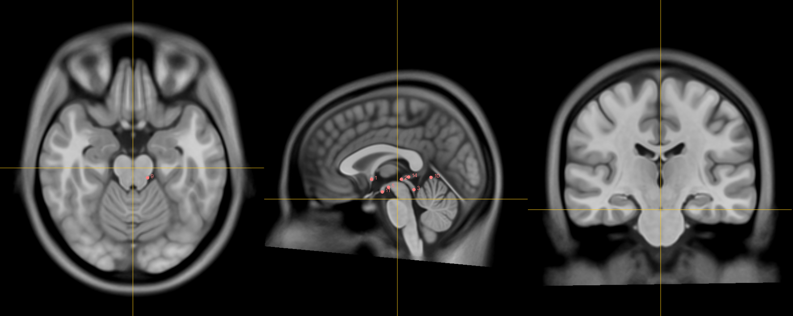</a>

### 5. Superior interpeduncular fossa [midline]

**Name:** 5  
**Description:** superior interpeduncular fossa  
**Acronym:** SIPF

* Most superior axial slice showing the interpeduncular fossa
* Use coronal slice to help optimize location at boundary of 3rd ventricle and surrounding brain
* Commentary: useful fiducial location for DBS since subthalamic nucleus close by

<a href="../img/human/05_SIPF.png" target="_blank">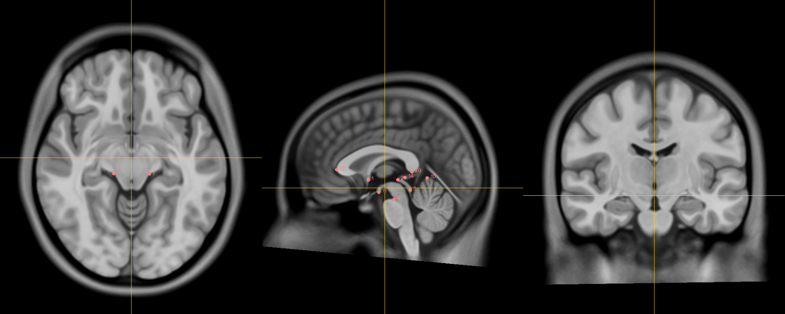</a>

### 6. Right superior lateral mesencephalic sulcus

**Name:** 6  
**Description:** R superior LMS  
**Acronym:** RSLMS

* Localize using axial slices; at boundary of CSF and brain
* Use the coronal and sagittal views to optimize the location so that this point is in the angle created in all views

### 7. Left superior lateral mesencephalic sulcus

**Name:** 7  
**Description:** L superior LMS  
**Acronym:** LSLMS

* As in 6

<a href="../img/human/07_LSLMS.png" target="_blank">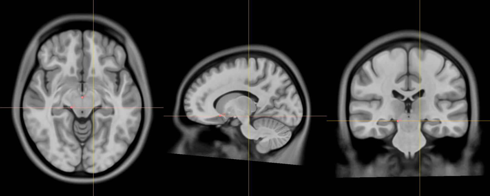</a>

### 8. Right inferior lateral mesencephalic sulcus

**Name:** 8  
**Description:** R inferior LMS  
**Acronym:** RILMS

* Localize at junction between midbrain and pons first using axial slices
* Refine positioning using sagittal view (at the change in angle of brainstem at the PMJ)

### 9. Left inferior lateral mesencephalic sulcus

**Name:** 9  
**Description:** L inferior LMS  
**Acronym:** LILMS

* As in 8

<a href="../img/human/09_LILMS.png" target="_blank">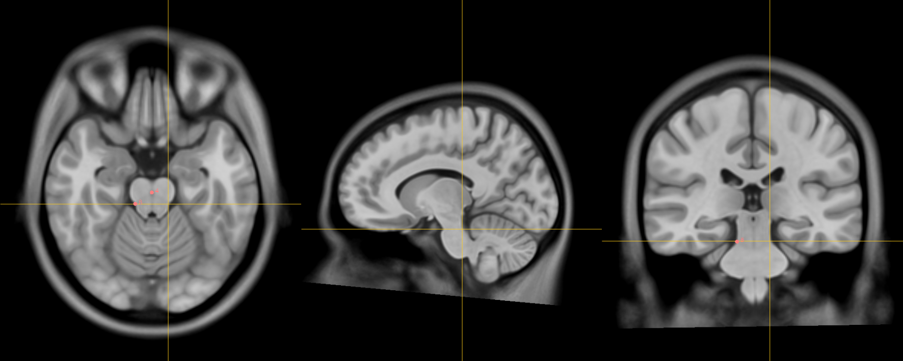</a>

### 10. Culmen [midline]

**Name:** 10  
**Description:** culmen  
**Acronym:** CUL

* Jump to AC or another midline AFID to get to the mid-sagittal slice, then place using the sagittal view
* Most superior point of cerebellar vermis; one of the vermian lobules
* The axial view is helpful for refining placement at the apex.

<a href="../img/human/10_CUL.png" target="_blank">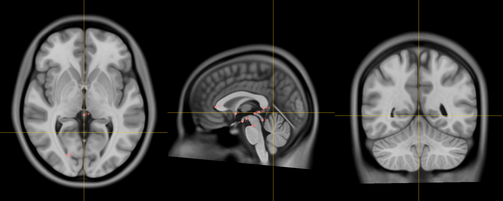</a>

### 11. Intermammillary sulcus [midline]

**Name:** 11  
**Description:** intermammillary sulcus  
**Acronym:** IMS

* Click to jump to AC landmark and place using the sagittal view 
* Midpoint between the mamillary bodies; place at the border of the grey matter
* Refine placement using axial and coronal views.

<a href="../img/human/11_IMS.png" target="_blank">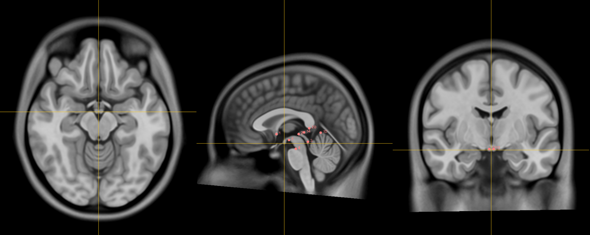</a>

### 12. Right mammillary body

**Name:** 12  
**Description:** R MB  
**Acronym:** RMB

* Place at the center of the mammillary body

### 13. Left mamillary body

**Name:** 13  
**Description:** L MB  
**Acronym:** LMB

* As in 12

### 14. Pineal gland [midline]

**Name:** 14  
**Description:** pineal gland  
**Acronym:** PG

* Click to jump to the AC landmark on the sagittal view and place AFID in the middle of gland (use all views to correctly place this point)
* Occasionally the pineal gland is calcified, which makes it more difficult to find the center of the gland. Be sure to scroll back and forth in all views to find the true center point regardless of asymmetry of calcifications

### 15. Right lateral aspect of frontal horn at AC

**Name:** 15  
**Description:** R LV at AC  
**Acronym:** RLVAC

* Defined at same coronal slice as AC (jump to it)

<a href="../img/human/15_RLVAC.png" target="_blank">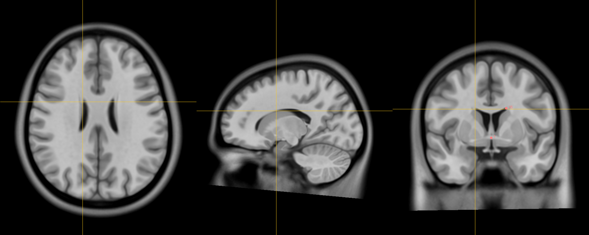</a>

### 16. Left lateral aspect of frontal horn at AC

**Name:** 16  
**Description:** L LV at AC  
**Acronym:** LLVAC

* As in 15

### 17. Right lateral aspect of frontal horn at PC

**Name:** 17  
**Description:** R LV at PC  
**Acronym:** RLVPC

* Defined at same coronal slice as PC (jump to it)

### 18. Left lateral aspect of frontal horn at PC

**Name:** 18  
**Description:** L LV at PC  
**Acronym:** LLVPC

* As in 17

<a href="../img/human/18_LLVPC.png" target="_blank">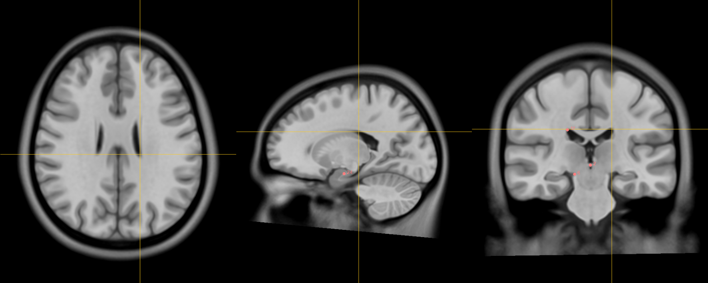</a>

### 19. Genu of corpus callosum [midline]

**Name:** 19  
**Description:** genu of CC  
**Acronym:** GENU

* Jump to AC and place using sagittal view
* Optimize using coronal view as most anterior point of the corpus callosum on coronal slice.
* Midline vessels (anterior cerebral arteries) may be prominent in this region. Adjusting contrast allows for differentiation between grey matter and vessels. Refine using the axial view. 

### 20. Splenium of the corpus callosum [midline]

**Name:** 20  
**Description:** splenium of CC  
**Acronym:** SPLE

* Jump to AC and place using sagittal view.
* Placement at inferior most point of the splenium at boundary with CSF.
* Optimize point using coronal and axial views.

### 21. Right anterolateral temporal horn

**Name:** 21  
**Description:** R AL temporal horn  
**Acronym:** RALTH

* Place using coronal view as the anterior-most (and lateral) point of temporal horn
* Choose a more ventral/inferior point on the coronal view where it is inferior and lateral to the amygdala.
* Navigate laterally using sagittal view and locate anterior-most (and lateral) point of temporal horn where it is anterior to the hippocampus separated by CSF in the lateral ventricle.
* Place at the boundary of CSF and brain

<a href="../img/human/21_RALTH.png" target="_blank">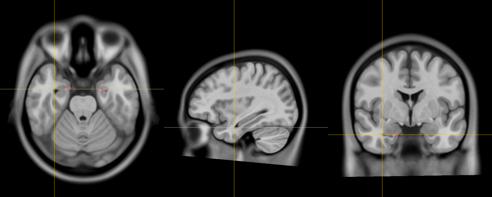</a>

### 22. Left anterolateral temporal horn

**Name:** 22  
**Description:** L AL temporal horn  
**Acronym:** LALTH

* As in 21

<a href="../img/human/22_LALTH.png" target="_blank">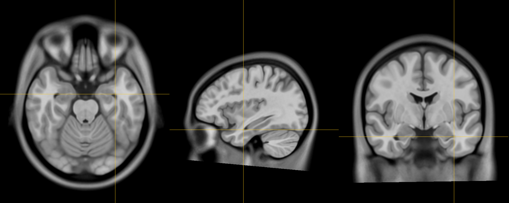</a>

### 23. Right superior AM temporal horn

**Name:** 23  
**Description:** R superior AM temporal horn  
**Acronym:** RSAMTH

* Note: there are both superior and inferior anteromedial (AM) temporal horn fiducials.
* In the coronal view, the superior AM temporal horn is located superior to the head of the hippocampus at the level of the optic tract.
* In the axial view, it is situated in the uncus and bounded anteriorly by the amygdala and posteriorly by the hippocampus.
* Proceed lateral while monitoring the coronal view. Place fiducial at the superior hippocampal-amygdalar transition area (HATA). Verify in the axial view.
* NOTE: there is also an inferior anteromedial temporal horn

* * alias: Rhoton's uncal recess: "narrow medially projecting space between hippocampal head & ventricular surface of amygdala located lateral to uncal apex"
* Place at the boundary of CSF and brain

<a href="../img/human/23_RSAMTH.png" target="_blank">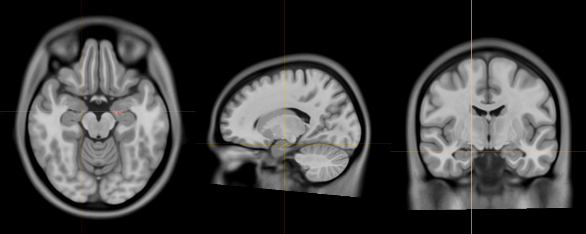</a>

### 24. Left superior AM temporal horn

**Name:** 24  
**Description:** L superior AM temporal horn  
**Acronym:** LSAMTH

* alias: Rhoton's left uncal recess
* As in 23

### 25. Right inferior AM temporal horn

**Name:** 25  
**Description:** R inferior AM temporal horn  
**Acronym:** RIAMTH

* In the coronal view, the inferior AM temporal horn is located inferior to the amygdala.
* In the axial view, it is bounded anteriorly by the amygdala and posteriorly by the hippocampus.
* In the sagittal view, it is bounded posteriorly by the hippocampal head and amygdala. The ventricle should appear in the sagittal view as a small opening at this point.
* Verify that the fiducial is place at the junction of the ventricle-grey matter in the axial view. 

<a href="../img/human/25_RIAMTH.png" target="_blank">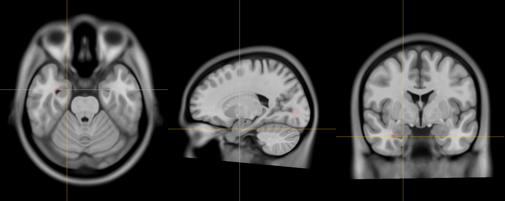</a>

### 26. Left inferior AM temporal horn

**Name:** 26  
**Description:** L inferior AM temporal horn  
**Acronym:** LIAMTH

* Like in 25
* Jump to 22 (left AL temporal horn) and scroll the find the most medial showing of the CSF

<a href="../img/human/26_LIAMTH.png" target="_blank">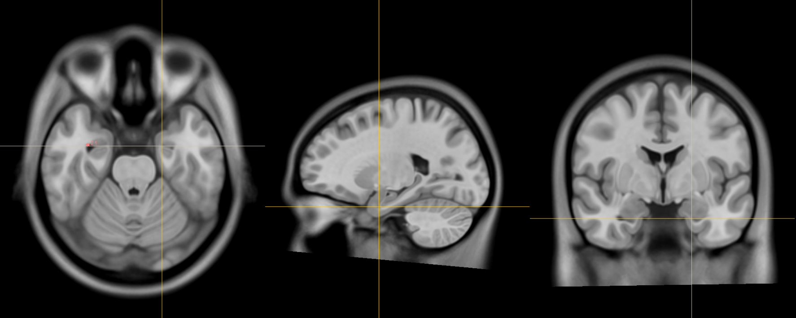</a>

### 27. Right indusium griseum origin

**Name:** 27  
**Description:** R indusium griseum origin  
**Acronym:** RIGO

* The indusium griseum is also known as the "supracommissural" portion of the hippocampus running along the dorsal part of the corpus callosum. The objective with this fiducial is to identify its origin. This is where it diverges from the hippocampus proper.
* On the sagittal view, this is the point where gray matter separate from the hippocampus proper begins to "takeoff" below splenium and becomes pointed.
* Verify that the fiducial is at the junction of white and grey matter.
* Other pointers: The indusium griseum is bounded on the sagittal and coronal views by the posterior-inferior edge of the atrium of the lateral ventricle.

### 28. Left indusium griseum origin

**Name:** 28  
**Description:** L indusium griseum origin  
**Acronym:** LIGO

* As in 27

### 29. Right ventral occipital horn

**Name:** 29  
**Description:** R ventral occipital horn  
**Acronym:** RVOH

* Best defined in the coronal view at the ventral/inferior portion of the occipital horn (try to choose the last coronal slice in which this feature is visible to ensure point delimits the posterior most margin of the occipital horn possible)
* If it is hard to see on the coronal view then you can make the first placement using the axial view (make sure the view is on the right side of the brain).
* Optimize using other views

### 30. Left ventral occipital horn

**Name:** 30  
**Description:** L ventral occipital horn  
**Acronym:** LVOH

* As in 29

<a href="../img/human/30_LVOH.png" target="_blank">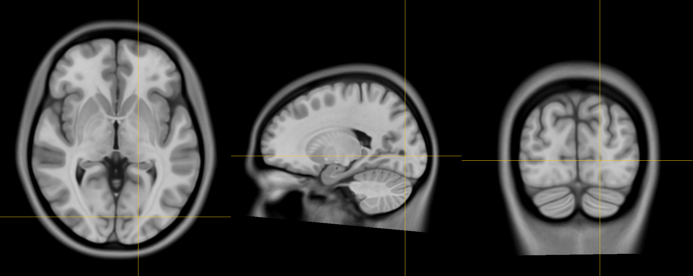</a>

### 31. Right olfactory sulcal fundus

**Name:** 31  
**Description:** R olfactory sulcal fundus  
**Acronym:** ROSF

* This fiducial is close to the Genu of Corpus Collosum (#19).
* Scroll back and forth in the sagittal view until you find the most anterior aspect of genu on the right hemisphere. (Typically before genu becomes continuous with other white matter structures). Note: ensure you are on the appropriate hemisphere (in this case the right).
* Monitoring the axial view proceed ventral until the fundus is reached. Verify using the coronal view.
* Sulcal fundus = at depth of sulcus and boundary of gray matter-white matter
* Posterior and most superior portion visible on axial slice

<a href="../img/human/31_ROSF.png" target="_blank">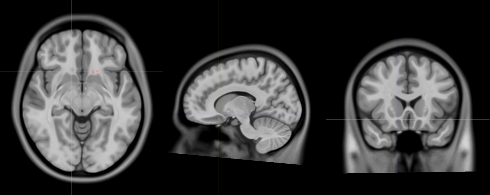</a>

### 32. Left olfactory sulcal fundus

**Name:** 32  
**Description:** L olfactory sulcal fundus  
**Acronym:** LOSF

* As in 31

<a href="../img/human/32_LOSF.png" target="_blank">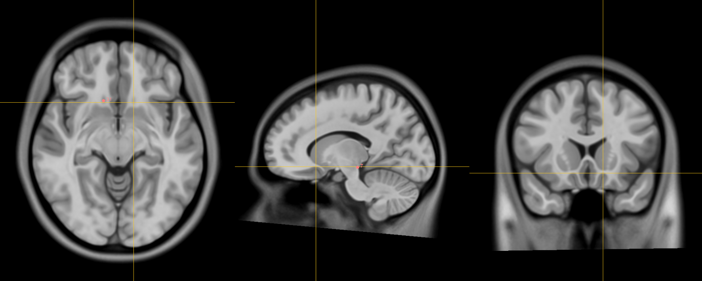</a>
